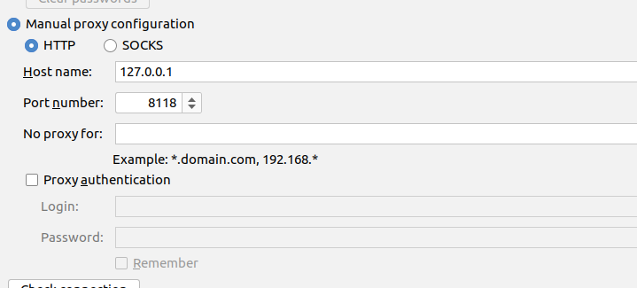
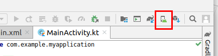
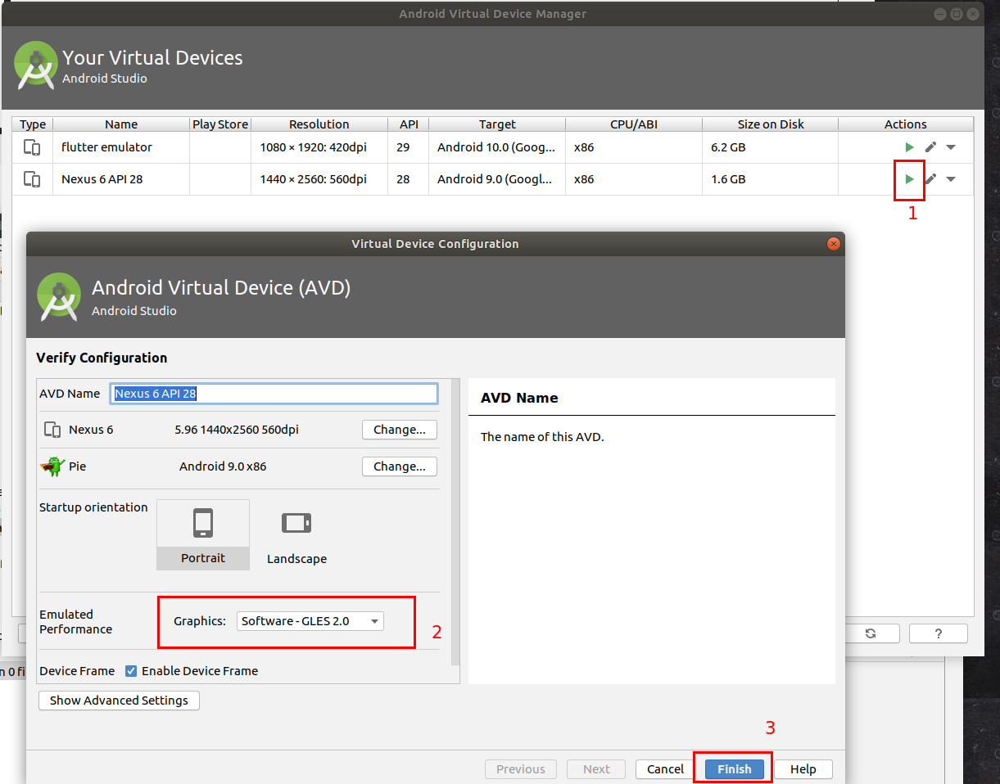

# Flutter 学习笔记

### 1. Flutter环境搭建

flutter需要的部件:

+ flutter sdk
+ android studio
+ 编辑器配置
+ 安卓模拟器

#### 1. flutter sdk的安装方法

> 如果是windows，应该直接按照官网教程安装没有问题，
>
> 本文的配置环境是在ubuntu 18.04 + 科学上网环境下安装成功的教程
>
> 如果没有科学上网的话，推荐使用flutter中文网上的方法使用国内源进行下载(速度更快):
>
> https://flutterchina.club/get-started/install/

+ 通过[flutter官网下载渠道](https://flutter.dev/docs/get-started/install/linux)下载linux专用的flutter sdk下载包
+ 解压文件到到制定目录

~~~bash
cd ~/Desktop/Flutter
tar xf ~/Downloads/flutter_linux_v1.12.13+hotfix.5-stable.tar.xz
~~~

+ 将flutter配置到对应对应的bash文件下

~~~bash
# 我用的是zsh，如果是bash的话把文件名改为.bashrc
echo export PATH="$PATH:`pwd`/flutter/bin" >> ~/.zshrc
~~~

+ 然后使该文件立即生效

~~~bash
source ~/.zshrc
# 测试flutter sdk安装是否成功
flutter doctor
~~~

出现结果只要不是flutter命令不存在说明安装成功，之后配置后续环境

#### 2. 安装android studio

+ 在ubuntu64 位机下需要安装一些32位的库

~~~bash
sudo apt-get install libc6:i386 libncurses5:i386 libstdc++6:i386 lib32z1 libbz2-1.0:i386
~~~

+ 安装java

~~~bash
sudo apt install default-jdk
# 安装完成后查看java版本
java --version
~~~

这里要注意java的版本，如果是通过sdkmanager进行后续android studio sdk的安装的话，这里java版本最好在10以下，不然后面会报错，解决方法：

[利用sdkmanager安装android sdk](https://linoxide.com/linux-how-to/install-android-sdk-manager-ubuntu/)

+ 下载android studio包，进行离线安装

通过[官网下载地址](https://developer.android.com/studio/#downloads)下载android studio IDE, 将得到的下载包进行解压

~~~bash
cd ~/Desktop/Android
tar -zxvf ~/Downloads/android-studio-ide-191.6010548-linux.tar.gz
# 运行android studio

cd ./android-studio/bin
./studio.sh
~~~

如果能够运行成功，说明android studio 安装成功

#### 3. 安装android sdk

采用android studio向导进行安装(这里一定要有梯子阿，不然会一直不成功)，我们需要通过设置代理，让下载的流量走到我们自己的梯子上，也就是从外部代理过，不然国内下载外部资源会失败。

**如果是shadowsocks的梯子的话，这里注意一点，因为ss是sock5的代理服务器，但是好像直接配置sock代理不生效,**, 我们需要通过**privoxy**将socks5的网络代理走到http的代理，具体方法可以参考[将socks请求转换为http](https://maplege.github.io/2017/09/04/socksTOhttp/)

**操作过程**

+ 安装prioxy

~~~bash
sudo apt-get install prioxy
~~~

+ 配置对应的配置文件

~~~bash
sudo vim /etc/privoxy/config
~~~

+ 添加代理端口

~~~bash
# 这里为你socks5代理服务器的端口
forward-socks5   /               127.0.0.1:1080 .
# 原文中说还要注意该下面
# 但是实测后发现，这句话不用加上去，可以搜索一下listen-address
# 其本身就有相应的监听端口，所以默认就不改了
listen-address localhost:8118
~~~

+ 重启prioxy服务

~~~bash
sudo service privoxy resstart
~~~

+ 配置android studio 代理

  这里要注意一定是配置为转发请求的代理端口也就是8118，如下图配置

  

+ 之后下载让他下载就好了，下载成功就能进入android studio的界面了，可能中间时间比较长

#### 4. 启动安卓模拟器

+ 点击工具栏中的AVD Manager打开管理界面

+ 添加对应的想要配置的模拟器，下载系统插件等
+ 完成后运行模拟器

**问题一：**

**模拟器文件安装失败**，或者安装失败因为权限的问题，是因为/dev/kvm没有访问权限，通过更改这个文件夹权限的方法即可完成对该文件夹的使用，其方法可参考[Android Studio 运行时出现/dev/kvm没有权限问题解决办法](https://blog.csdn.net/fesdgasdgasdg/article/details/83044535)

~~~bash
sudo chmod -R 755 /dev/kvm
# 这里需要将我的用户名改为你现在系统操作的用户名
sudo chown cyx -R /dev/kvm
~~~

**问题二：**

**运行模拟器秒退**，可能原因是多个CPU渲染而bios不兼容导致的，解决方法，使用软件渲染，禁用硬件渲染

#### 插件安装

使用vscode插件安装直接安装dart和flutter就好了，这里直接略过了

#### 结论

至此，通过flutter doctor 应该已经所有问题都通过了，如果android-license还有问题的话 使用提示的代码直接安装就好了

### 2. 基础组件的使用

#### 0. 心得

flutter并不像前端一样有分离的js,css,javascript,都是通过组件的形式进行安排的，布局是一个组件对象内的属性等等，因此组件是flutter的基础，一切控件的位置什么的都是通过组件配置的来实现的

#### 1. Text组件

text是用于添加文字元素的，并给文字设置样式等。

##### 代码案例

~~~dart
import "package:flutter/material.dart";

void main() => runApp(new MyApp());

class MyApp extends StatelessWidget {
  @override
  Widget build(BuildContext context) {
    return new MaterialApp(
      title: 'First App',
      home: new Scaffold(
        appBar: new AppBar(
          title: new Text('第一个App'),
        ),
        body: new Center(
          child: new Text(
            '你好阿,用于测试长文本，你好阿,用于测试长文本你好阿,用于测试长文本你好阿,用于测试长文本你好阿,用于测试长文本你好阿,用于测试长文本你好阿,用于测试长文本你好阿,用于测试长文本',
            textAlign: TextAlign.center,
            overflow: TextOverflow.ellipsis,
            maxLines: 1,
            style: TextStyle(
              fontSize: 20,
              color: Color.fromARGB(255, 255, 133, 60),
              decoration: TextDecoration.lineThrough,
              decorationStyle: TextDecorationStyle.wavy
            ),
          ),
        ),
      ),
    );
  }
}

~~~

##### 结构说明：

+ appBar: 顶部的导航兰
+ body: 是下面的内容区
+ center代表垂直意义上的居中组件，其中的child代表center组件的族要内容
+ 这里的Text是一个一个组件
  + textAign: 用于设置文字位置
  + overflow: 用于设置文字溢出maxLines后的表现状态
  + style用于处理字体的具体样式

更多的API设定可以查看官方手册：[给文本添加样式]([https://flutterchina.club/web-analogs/#%E7%BB%99%E6%96%87%E6%9C%AC%E6%B7%BB%E5%8A%A0%E6%A0%B7%E5%BC%8F](https://flutterchina.club/web-analogs/#给文本添加样式))

#### 2. Container组件

该组件可以是一个容器，可以设置宽高，背景底色，margin, padding等，内部还可以作各种布局，类似于前端里面的拥有flex的div的感觉

##### 代码案例

~~~dart
import "package:flutter/material.dart";

void main() => runApp(new MyApp());

class MyApp extends StatelessWidget {
  @override
  Widget build(BuildContext context) {
    return new MaterialApp(
      title: 'First App',
      home: new Scaffold(
        appBar: new AppBar(
          title: new Text('第一个App'),
        ),
        // 使用Container的例子
        body: Center(
          child: Container(
            child: new Text(
              'Hello',
              style: TextStyle(fontSize: 30),
            ),
            alignment: Alignment.topLeft,
            width: 1000,
            height: 200,
            // color: Colors.lightBlue,
            padding: const EdgeInsets.all(10),
            margin: EdgeInsets.all(10),
            decoration: new BoxDecoration(
              // 如果用渐变色的话和color这个背景色的属性不能重叠使用
              gradient: const LinearGradient(
                colors: [Colors.lightBlue, Colors.orangeAccent]
              ),
              border: Border.all(width: 2, color: Colors.black),
              transform: Matrix4.rotationZ(1/12),
            ),
          ),
        ),
      ),
    );
  }
}

~~~

##### 结构说明

+ child代表里面的主要内容
+ width，height等用来设定该元素中的样式属性
+ transform，类似于css的transform有一些旋转，放大缩小的操作
+ margin和padding后的参数不跟const 也是可以生效的

具体可以参考[Container属性介绍](https://api.flutter.dev/flutter/widgets/Container-class.html)

#### 3. Image组件

##### 代码案例

~~~dart
import 'dart:io';

import "package:flutter/material.dart";

void main() => runApp(new MyApp());

class MyApp extends StatelessWidget {
  @override
  Widget build(BuildContext context) {
    return new MaterialApp(
      title: 'First App',
      home: new Scaffold(
        appBar: new AppBar(
          title: new Text('第一个App'),
        ),
        // 使用image asset的例子
        body: Center(
          child: Container(
            child: new Column(children: [
              new Text(
                'Hello',
                style: TextStyle(fontSize: 30),
              ),
              new Image.asset(
                'assets/images/icon.jpg',
                width: 500,
                height: 100,
                fit: BoxFit.contain,
                alignment: Alignment.bottomCenter,
                // 给图片加滤镜
                color: Colors.greenAccent,
                colorBlendMode: BlendMode.softLight,
                repeat: ImageRepeat.repeat
              )
            ]),
            alignment: Alignment.topLeft,
            width: 1000,
            height: 500,
            // color: Colors.lightBlue,
            padding: const EdgeInsets.all(10),
            margin: EdgeInsets.all(10),
            decoration: new BoxDecoration(
                gradient: const LinearGradient(
                    colors: [Colors.lightBlue, Colors.orangeAccent]),
                border: Border.all(width: 2, color: Colors.black)),
            transform: Matrix4.rotationZ(1 / 12),
          ),
        ),
      ),
    );
  }
}

~~~

##### 结构说明

+ 为一个container中添加多个元素可以通过Row或者Column组件，这些组件的child组件接受一个widget的数组，可以渲染多个组件
+ Image组件的使用

| 对象方法      | 作用                | 使用方法                                                     |
| ------------- | ------------------- | ------------------------------------------------------------ |
| Image.network | 插入网络图片        | 直接以字符串的形式输入网络图片地址即可，之后在配置图片的长宽，等等配置参数即可 |
| Image.assets  | 插入资源图片        | 1. 在目录下创建一个assets文件，下面对应文件夹防止 2. 配置pubspec.yaml文件，添加要加载的资源 例如添加:        assets:              \- assets/images/icon.jpg  3. 使用Image.asset('静态资源路径') |
| Image.file    | 使用设备中的图片    | 使用Image.File(File('设备资源的路径地址'))                   |
| Image.memory  | 加载Uint8List的图片 | 参数为一个base64的字符串                                     |

#### 4. ListView  列表组件

##### 1. 基础列表

###### 代码案例

~~~dart
import "package:flutter/material.dart";

void main() => runApp(new MyApp());

class MyApp extends StatelessWidget {
  @override
  Widget build(BuildContext context) {
    return MaterialApp(
        title: '使用ListView',
        home: Scaffold(
          appBar: new AppBar(title: new Text('使用 List View')),
          body: Container(alignment: Alignment.center, child: new MyList()),
        ));
  }
}

class MyList extends StatelessWidget {
  @override
  Widget build(BuildContext context) {
    // TODO: implement build
    return new ListView(
      scrollDirection: Axis.vertical,
      children: <Widget>[
        new ListTile(
          leading: new Text(
            "赞",
            style:
                TextStyle(color: Colors.redAccent, fontWeight: FontWeight.w800),
          ),
          title: new Text('add_box'),
        ),
        new ListTile(
          leading: new Icon(Icons.add_call),
          title: new Text('add Call'),
        ),
        new Container(
          child: new Image.asset('assets/images/icon.jpg'),
          decoration: new BoxDecoration(
              border: Border.all(color: Colors.greenAccent, width: 3)),
          margin: EdgeInsets.all(10),
          padding: EdgeInsets.all(20),
        ),
        new Image.asset('assets/images/icon.jpg'),
      ],
    );
  }
}
~~~

###### 结构说明

+ listView外部不能嵌套Row组件，否则会报错
+ ListView是一个大的容器，里面的ListTile相当于每条列表信息，通过配置leading是设置最左边的表示，title代表的是他的标题
+ listView中的Children可以包含各种组件都是OK的
+ 组件的封装就相当于重新创建一个class然后通过 new 调用这个组件即可

##### 2. 动态ListView

###### 代码案例

~~~dart
import "package:flutter/material.dart";

void main() =>
    runApp(new MyApp(item: new List<String>.generate(100, (i) => "Item $i")));

class MyApp extends StatelessWidget {
  final List<String> item;
  MyApp({Key key, @required this.item}) : super(key: key);

  @override
  Widget build(BuildContext context) {
    return MaterialApp(
        title: '使用ListView',
        home: Scaffold(
            appBar: new AppBar(title: new Text('使用 List View')),
            body: new ListView.builder(
              itemCount:item.length,
              itemBuilder: (context, index) {
                return new ListTile(
                  title: new Text('${item[index]}'),
                );
              },
            )));
  }
}
~~~

###### 结构说明

+ List定义之后，通过generate 类似于JS中的map语法 产生对应的字符串
+ class传参，类中获取参数的步骤
  + final List<String> item 声明参数的类型和 参数名
  + 利用MyApp({Key key, @required this.item}): super(key: key), 声明，从父类继承的key和外部获取的元素需要通过@required进行获取 
  + 之后在类内调用获取的参数直接用item调用就好，不需要再通过this关键字进行调用
+ ListView根据参数动态生成列表的方法:
  + 设定itemCount的数量， listView动态生成列表的原理，根据itemCount进行循环生成
  + 通过itemBuilder进行动态生成，其中的index是循环的索引值，通过item[index]获得循环到的元素，之后通过获得的该元素，来组织得到每个单独的模块，来动态生成
  + 返回一个ListTile组件放到ListView中

#### 5. GridView网格列表

**GridView 和 ListView的区别**: listView是一个列表(左右上下的滑动列表)，类似于li，Grid是一个规定行列的表格，类似于table

###### 代码案例

~~~dart
class MyApp extends StatelessWidget {
  @override
  Widget build(BuildContext context) {
    return MaterialApp(
      title: 'Grid View',
      home: Scaffold(
          appBar: new AppBar(title: new Text('Grid View')),
          body: GridView(
            gridDelegate: SliverGridDelegateWithFixedCrossAxisCount(
                crossAxisCount: 4,
                // 纵向之间的间隔
                mainAxisSpacing: 10.0,
                // 横向之间的间隔
                crossAxisSpacing: 10.0,
                // 长宽比
                childAspectRatio: 0.5),
            children: <Widget>[
              Image.network(
                  'http://img5.mtime.cn/mt/2019/12/06/151723.54470898_140X210X4.jpg'),
              Image.network(
                  'http://img5.mtime.cn/mt/2019/12/27/102155.97632815_140X210X4.jpg'),
              Image.network(
                  'http://img5.mtime.cn/mt/2019/12/17/105242.88827408_140X210X4.jpg'),
              Image.network(
                  'http://img5.mtime.cn/mt/2019/12/27/101619.41873766_140X210X4.jpg'),
              Image.network(
                  'http://img5.mtime.cn/mt/2019/12/16/102337.73663733_140X210X4.jpg'),
              Image.network(
                  'http://img5.mtime.cn/mt/2020/01/16/151210.15087026_140X210X4.jpg'),
              Image.network(
                  'http://img5.mtime.cn/mt/2019/12/27/101619.41873766_140X210X4.jpg'),
              Image.network(
                  'http://img5.mtime.cn/mt/2019/12/16/102337.73663733_140X210X4.jpg'),
              Image.network(
                  'http://img5.mtime.cn/mt/2020/01/16/151210.15087026_140X210X4.jpg'),
            ],
          )),
    );
  }
}
~~~

###### 结构说明

+ GridView的效果是一个相册的效果就是手机点开相册，一块块豆腐干排列的效果
+ 常用参数说明gridDelegate
  + crossAxisCount: 横向的最大排列元素的个数
  + crossAxisSpacing: 横向元素时间的间隔
  + crossAxisSpacing: 纵向元素之间的间隔
  + childAspectRatio: 长宽比(横纵比)，这里是横的长度比纵宽度的
  + children: 是一个Widget[]

### 3. 布局部分

##### 1. Row水平布局

所谓的水平布局就是**单一横向的行内布局, 类似div标签**,每次调用一个Row，他会自动占用一行，其高度由内部元素的高度决定，Row组件是一个支持**弹性盒**布局的组件

###### 代码案例

~~~dart
class MyApp extends StatelessWidget {
  @override
  Widget build(BuildContext context) {
    return MaterialApp(
      title: 'Layout Widget Demo',
      home: Scaffold(
        appBar: new AppBar(
          title: new Text('Row Layout demo'),
        ),
        body: Row(
          children: <Widget>[
            Container(
              child: Center(
                child: Text(
                  '左边的文字',
                  style: TextStyle(color: Colors.white, fontSize: 15),
                ),
              ),
              width: 300,
              height: 200,
              decoration: BoxDecoration(
                  gradient: LinearGradient(colors: [
                Colors.lightBlue,
                Colors.lightGreen,
                Colors.orangeAccent,
                Colors.redAccent
              ])),
            ),
            // 启用弹性盒模式
            Expanded(
              child: Container(
                child: Text('右边的文字'),
                color: Colors.blueAccent,
                margin: EdgeInsets.fromLTRB(10, 0, 0, 0),
                height: 200.0,
                alignment: Alignment.center,
              ),
            )
          ],
        ),
      ),
    );
  }
}
~~~

###### 结构说明

+ Row是一个横向布局的组件，其子元素会被横向排列，如果宽度大于屏幕宽度，则会把超出部分顶出屏幕
+ Row 是一个弹性盒模型，因此通过在子组件外包一个Expanded组件可以实现弹性布局
+ 这里适用于的布局情况是一端固定一端长度自适应，如果需要百分比布局的话需要使用FractionallySizedBox

##### 2. Column纵向布局

***column***是根据children中的最宽的元素作为列宽，做的整一列的布局，也支持弹性盒布局

###### 代码案例

~~~dart
class MyApp extends StatelessWidget {
  @override
  Widget build(BuildContext context) {
    return MaterialApp(
      title: 'Layout Widget Demo',
      home: Scaffold(
          appBar: new AppBar(
            title: new Text('Column Layout demo'),
          ),
          body: new Center(
            child: new Column(
              crossAxisAlignment: CrossAxisAlignment.center,
              mainAxisAlignment: MainAxisAlignment.center,
              children: <Widget>[
                new RaisedButton(
                  onPressed: () {},
                  color: Colors.redAccent,
                  child: new Text('Red Botton'),
                ),
                Expanded(child: new Text('这是一个很长的内容')),
                new RaisedButton(
                  onPressed: () {},
                  color: Colors.yellowAccent,
                  child: new Text(
                    'yellow Button',
                    style: TextStyle(color: Colors.blueGrey),
                  ),
                ),
                new RaisedButton(
                  onPressed: () {},
                  color: Colors.lightBlue,
                  child: new Text(
                    'Blue Button',
                    style: TextStyle(color: Colors.blueGrey),
                  ),
                ),
              ],
            ),
          )),
    );
  }
}
~~~

###### 结构说明

+ Column布局是弹性盒布局，通过Expanded来作自适应宽度布局
+ crossAxisAlignment: 横向布局的对齐方式
+ mainAxisAlignment: 纵向布局的对齐方式

##### 3. 百分比布局

百分比布局主要有两个手段

+ 使用FractionallySizedBox
+ 使用Flexible组件

###### 代码案例

+ 使用FractionallySizedBox

~~~dart
class MyApp extends StatelessWidget {
  @override
  Widget build(BuildContext context) {
    return MaterialApp(
      title: 'Layout Widget Demo',
      home: Scaffold(
          appBar: new AppBar(
            title: new Text('Row Layout demo'),
          ),
          body: Column(
            children: <Widget>[
              Row(
                children: <Widget>[
                  Container(
                    width: 300,
                    height: 300,
                    color: Colors.red,
                    alignment: Alignment.bottomRight,
                    child: FractionallySizedBox(
                      widthFactor: 0.7,
                      heightFactor: 0.5,
                      child: Container(
                        height: 200,
                        color: Colors.blue,
                      ),
                    ),
                  )
                ],
              )
            ],
          )),
    );
  }
}
~~~

+ 使用Flexible

~~~dart
class MyApp extends StatelessWidget {
  @override
  Widget build(BuildContext context) {
    return MaterialApp(
      title: 'Layout Widget Demo',
      home: Scaffold(
          appBar: new AppBar(
            title: new Text('Row Layout demo'),
          ),
          body:
              Container(
                height: 500,
                margin: EdgeInsets.all(10),
                child: 
                Column(
                  children: <Widget>[
                    Flexible(
                      // 设置在所有Flex元素中的百分比占1/5
                      flex: 1,
                      child: Container(
                        decoration: BoxDecoration(
                          borderRadius: BorderRadius.circular(10),
                          border: Border.all(width: 1, color: Colors.black),
                          color: Colors.red,
                        ),
                      ),
                    ),
                    Flexible(
                      // 占 3/5
                      flex: 3,
                      child: Container(
                        decoration: BoxDecoration(
                          borderRadius: BorderRadius.circular(10),
                          border: Border.all(width: 1, color: Colors.black),
                          color: Colors.red,
                        ),
                        margin: EdgeInsets.fromLTRB(0, 10, 0, 10),
                      ),
                    ),
                    Flexible(
                     // 占1/5
                      flex: 1,
                      child: Container(
                        decoration: BoxDecoration(
                          borderRadius: BorderRadius.circular(10),
                          border: Border.all(width: 1, color: Colors.black),
                          color: Colors.red,
                        ),
                      ),
                    ),
                  ],
                ),
              )
            ),
    );
  }
}
~~~

###### 结构说明

+ FractionallySizedBox通过设置widthFactor, heightFactor可以将盒子的大小设置为父元素的百分比
+ FractionallySizedBox一般用来设置和父元素之间存在百分比大小的元素的场和宽，一般父元素内只有一个元素的时候用比较好
+ Flexible包裹的元素，通过flex设定其在所有flexible元素中的百分比，比如一共flex的有5份，设为flex:1的元素就是占1/5，和flex布局中的flex属性类似。

##### 4. 层叠布局(绝对定位)

###### 代码案例

~~~dart
class MyApp extends StatelessWidget {
  @override
  Widget build(BuildContext context) {
    // TODO: implement build
    var stack = new Stack(
      children: <Widget>[
        new Container(
          height: 300,
          color: Colors.lightGreen,
        ),
        new Container(
          decoration: new BoxDecoration(
              color: Colors.lightBlue,
              border: Border.all(width: 1, color: Colors.pinkAccent)),
          padding: EdgeInsets.all(10.0),
          margin: EdgeInsets.all(20.0),
          child: new Text('Caption'),
        ),
        new Positioned(
          top: 10.0,
          left: 200,
          child: new Container(
            decoration: BoxDecoration(
                color: Colors.red,
                border: Border.all(width: 1, color: Colors.greenAccent)),
            child: new Text('第二个层叠'),
          ),
        ),
      ],
      alignment: const FractionalOffset(0.5, 0.9),
    );

    return new MaterialApp(
      title: '层叠布局',
      home: Scaffold(
        appBar: new AppBar(title: new Text('层叠布局')),
        body: stack,
      ),
    );
  }
}

~~~

###### 结构说明

+ 利用stack生成层叠对象，写在越前面的元素放在越下面，类似于z-index值越小
+ 利用Positioned包裹的元素其对齐位置按照top, left设置安排，如果没有包裹的元素继承Stack中的alignment
+ Postiion中设置百分比的定位还没研究过
+ FractionaslOffset可以设置其百分比对齐位置

### 4. Dart的基础语法

主要参考: [dart官方文档](https://dart.dev/samples)

#### 1. 变量

>  dart和javascript不同是一种强类型语言，所以其定义变量的时候需要给出具体变量的类型，如果不指定，变量的类型就已第一次定义的类型为准，如果赋值给其不同类型就会报错。

其变量定义方法通常为 **[声明符号]\(如果是dynamic可省略) + [类型]\(可省略) + [变量名]**,但是注意**声明符号和类型不能同时省略**

+ 声明号包括:

	+ var: 定义一个可变便变量，其后跟的类型省略，会自动获取赋值得到的类型，后续对其赋值，类型不能变
	+ final/const 指定一个不可变的变量值，只能在声明的时候被赋值一次，两者的区别是const 是在编译阶段为一个常量，如果const 用于class内，则需要将const 改为static const， final可以直接使用
	+ dynamic dynamic定义的一个可变变量，其类型和值都可变

+ 常用类型包括

  + 数值类型(Number): int，double
  + 字符串类型String
  + 布尔类型Booleans
  + 列表类型List和Set类型
  + Map类型

  除上述类型外，还有Runes and Grapheme Clusters 和 Symbols类型，具体作用前者好像是用于保存特殊字符，后者和js的symbol类似，以后用到再总结用法了。

##### 1. 数值变量

###### 1. 定义方法

~~~dart
  int num1 = 3;
  double num2 = 3.053;
  var expNum = 1e5;

  print(expNum); // 100000
  // 自动识别为double;
  var res = num1 + num2;
  print(res); // 6.0
~~~

###### 2. 类型转换

+ String转int或者double, 使用*.parse方法
+ double, int转String使用toString等方法

~~~dart
  // int -> String
  print(num1.toString());
  // double -> String
  print('double2string ${res.toString()}'); // 6.053
  // 保留小数点后的位数
  print('double2String ${num2.toStringAsFixed(2)}'); // 3.05
  // 保留有效数字
  print('double2String ${num2.toStringAsPrecision(3)}'); // 3.1
  // 转换为指数
  print('trans2Exp ${num2.toStringAsExponential()}'); // 3.053e+0

  // string -> int or doublue
  // 使用Number的parse方法

  String s2n1 = '1';
  String s2n2 = '1.1';

  print('s2n1 = ${int.parse(s2n1)} s2n2 = ${double.parse(s2n2)}'); // s2n1 = 1 s2n2 = 1.1

~~~

##### 2. 字符串变量

###### 1. 定义方法

~~~dart
// 字符串类型
var s1 = "string";
String s2 = 'str2';
~~~

###### 2. 字符串拼接

+ 使用字符串之间的+运算
+ 使用$来调用表达式

~~~dart
  // 字符串拼接
  var s3 = '$s1 + $s2'; 
  var s4 = s1 + "+" + s2; 
  print(s3); // string + string2
  print(s4); // string+string2
~~~

###### 3. 创建多行文本

+ 多行内写字符串，中见不添加逗号
+ 使用"""三引号包裹

上述两种方法的区别：

+ 方法1是一种字符串拼接的方法，显示仍为统一行拼接
+ 方法2打印的结果也会换行

~~~dart
var multi1 = "multi1="
  "这是"
  "多行字符串1";

  var multi2 = """
  muliti2=
  这是
  多行字符串2
  """;
  

  print(multi1);
  /*
  multi1=这是多行字符串1
  */
  print(multi2);
  /*
    muliti2=
      这是
      多行字符串2
  */
~~~

###### 4. 字符串转义

在字符串前添加r即可转义

###### 6. 类型转换

+ 数值型和字符串转换参见数值变量
+ 字符串和List之间的转换方法
  + 字符串转List： split
  + List转字符串：join方法

~~~dart
  // 字符串转数组
  print(s1.split("")); // [s,t,r,i,n,g]

  // 字符串类型List定义
  List<String> friends = ['mary', 'jack'];
  print(friends.where((name) => name.startsWith('m'))); // mary
  // 数组转字符串
  print(friends.join("-"));// mary-jack
~~~

##### 3.布尔 类型

true 和 false，引用官网的代码

~~~dart
  // boolean
  // Check for an empty string.
  var fullName = '';
  print(fullName.isEmpty); // true

  // Check for zero.
  var hitPoints = 0;
  print(hitPoints <= 0); // true

  // Check for null.
  var unicorn;
  // 未定义值的变量为null 而不是undefined和js不同
  print(unicorn == null); // true

  // Check for NaN.
  // 除以0得到的结果为NaN
  var iMeantToDoThis = 0 / 0;
  print(iMeantToDoThis.isNaN); // true 
~~~

##### 4. 列表类型List

###### 1. 定义方法

~~~dart
  List<int> list1 = const [0, 1, 2];
  List<String> list2 = ['jack', 'mary'];
  List nullList;
~~~

###### 2. List元素的索引查看和修改

注意点：

+ list1定义了一个**不可修改的List**，因此如果对该数值进行修改会有问题
+ list2虽然是**可变的List**，但是如果**查看和修改不存在索引值会报错**，如果要**增加List**需要通过**add**方法

具体的看下面的例子

~~~dart
  print('list1[1] = ${list1[1]}'); // 1
  // 不可修改类型
  // list1[1] = 2; // 报错，因为这里的list1是不可修改类型

  // list2长度只有2，添加额外的第三个元素是不被允许的
  // list2[2] = 'Tom';
  // 如果要增加list长度需要使用add方法
  list2.add('tom');
  list2[1] = 'Mary'
  print(list2); // [jack, Mary, tom]
~~~

###### 3. list合并

Dart拥有两种List的合并方法(...)和(...?)两种：

+ **...**在**元素确定存在**的时候使用
+ **...?**保证在元素数组**不存在(声明了未赋值为null)**的时候不会报错，但是...?后面跟的一定是一个数组元素

看下面的例子

~~~dart
  // list合并
  var list3 = [...list2, ...list1, ...?nullList];
  print(list3); // [jack, Mary, tom, 0, 1, 2]
~~~

###### 4. List与if 和 for的连用

在List的定义过程中可以同for和if语法连用，十分灵活的感觉。

~~~dart
  const f1 = true;
  const f2 = false;

  List list4 = [
    '1',
    if(f1) 'f1',
    if(f2) 'f2',
    for (var i in list3) 'list4-$i' 
  ];

  print(list4);
~~~

##### 5. 集合类型Set

Set可以认为是一个没有重复的列表，其具体方法和List类似通过下面的例子直观看一下。

~~~dart
  Set<String> set1 = {"苹果", '香蕉', '火龙果'};
  set1.add('西瓜');
  set1.add('苹果');
  print(set1); // {苹果, 香蕉, 火龙果, 西瓜}
  set1.remove('西瓜'); // {苹果, 香蕉, 火龙果}
  print('苹果');
  print(set1);

  Set<String> set2 = {'包子','馒头', '火腿肠'};
  print({...set1, ...set2}); // {苹果, 香蕉, 火龙果, 包子, 馒头, 火腿肠}

  bool addFood = false;
  List<String> fruit  = ['樱桃', '山竹', '水蜜桃'];

  print({...set1, if(addFood) ...set2, for(var i in fruit) 'extra-$i' }); // {苹果, 香蕉, 火龙果, extra-樱桃, extra-山竹, extra-水蜜桃}

~~~

+ ...和...?的拓展运算符也是一样支持的
+ if 和 for等语法也可在Set中应用

##### 6. Map类型

这里要注意和JS不一样，JS的对象字面写法类似与Dart，但是Dart中的**Map类型和类**是两个东西！

Map有好几种类型：Map, HashMap,LinkedHashMap,SplayTreeMap

其具体差别可以看[简单讲讲几种Map之间的区别](https://cloud.tencent.com/developer/article/1405855)

Map和LinkedHashMap都返回按照插入顺序排列的Map，但是HashMap在遍历时，顺序是无法保证的

###### 1. Map的创建、插入、删除、遍历

~~~dart
  var map1 = HashMap();
  map1['abc'] = '1';
  map1['cccasd'] = "2";
  map1['aaa123'] = "3";

  map1.forEach((key, value) => print('key=$key, value=$value'));
  /*
  	key=cccasd, value=2
    key=abc, value=1
    key=aaa123, value=3	
  */

  var map2 = Map(); // LinkedHashMap
  map2['abc'] = '1';
  map2['cccasd'] = "2";
  map2['aaa123'] = "3";

  print(map2); // {abc: 1, cccasd: 2, aaa123: 3}
	
  // LinkedHashMap可以保证遍历的顺序和插入顺序一致
  map2.forEach((key, value) => print('key=$key, value=$value'));
  /*
  	key=abc, value=1
    key=cccasd, value=2
    key=aaa123, value=3
  */

  map2.remove('abc');
  print(map2);// {cccasd: 2, aaa123: 3}
~~~

###### 2. Map的合并

~~~dart
  var map3 = {
    ...map1,
    ...map2
  };
  print(map3); // {cccasd: 2, abc: 1, aaa123: 3}

  var map4 = {
    ...map2
  };
  print(map4 == map2); // false
~~~

+ 合并时，相同键值的会合并
+ 合并后的Map和原来的Map并不相等

#### 2. 函数

函数是dart中的第一公民，也是一种对象，在dart中一切都是对象，因此也可以将函数作为参数传给函数或者对象

##### 1. 函数定义方法

Dart中的函数主要分为三种：

+ 位置参数函数
+ 具名函数
+ 匿名函数

###### 位置参数函数定义调用方式

+ 可选和必填参数的定义方法
  + 可选参数通过[]的形式进行包裹，这种参数在调用的过程中可以省略不添加
  + 如果没有通过[]的形式进行包裹说明该参数必填
  + 如果要给可选参数指定默认值，可以直接通过 **= + [默认值]**的方式添加参数的默认值

~~~dart
var favoriateFruit = {"苹果", '香蕉', '橘子'};
var fruitMap = {"苹果": 5.5, '香蕉': 3.99, '橘子': 6.8};

// 没有参数的函数
dynamic getFruitPrice() {
  print(favoriateFruit);
  print(fruitMap);
}

// 多重逻辑的时候需要使用函数表达式定义
// 未命名函数定义方法
// 通过位置参数命名的方式的函数，其需要通过添加匿名函数的话需要通过[]包裹对应的函数名
dynamic getPrice(String fruit, [String notes = '默认notes']) {
  if (notes != null) {
    print('notes = $notes');
  }

  if (favoriateFruit.contains(fruit)) {
    return fruitMap[fruit];
  }

  return null;
}

~~~

+ 位置参数函数的调用方式

~~~dart
void main(){
  var price = getPrice('香蕉', '看看香蕉的价格');
  // 可选参数可以先不赋值，启用默认赋值。
  var nullPrice = getPrice('火龙果');
  print(price);
  print(nullPrice);
}
/*
notes = 看看香蕉的价格
notes = 默认notes
3.99
null
*/
~~~

###### 具名函数的定义调用方式

**可选和不可选函数的定义方式**

+ 定义函数的时候传入一个类似于set的对象
+ 如果是必填参数需要使用@required进行声明
+ 没有通过required声明的均为可选参数
+ @required再meta.dart中定义，因此使用的时候需要添加meta包，不然会报错
+ 设定默认参数的方法和具名函数一样，利用等号赋值即可

~~~dart
import 'package:meta/meta.dart';

void addFruit(
    {String fruit = "", double price = 100.0, @required String notes}) {
  favoriateFruit.add(fruit);
  fruitMap[fruit] = price;
  print(notes);
}
~~~

> 添加meta包的方法，可以通过调用flutter包来解决，具体方法
>
> 	1. 创建一个pubspec.yaml的文件
>  	2. 填写下面代码即可
>
> ~~~yaml
> name: demo
> description: A new Dart project.
> # 主要是这个依赖
> dependencies:
>   flutter:
>     sdk: flutter
> ~~~
>
> 

**具名函数的调用方式**

~~~dart
addFruit(fruit: '草莓', price: 23.5, notes: '增加草莓');
// price没有被传入时使用默认值
addFruit(notes: '冬瓜，价格不详', fruit: '冬瓜');
getFruitPrice();
/*
    增加草莓
    冬瓜，价格不详
    {苹果, 香蕉, 橘子, 草莓, 冬瓜}
    {苹果: 5.5, 香蕉: 3.99, 橘子: 6.8, 草莓: 23.5, 冬瓜: 100.0}
*/
~~~

###### 匿名函数的定义

~~~dart
    List<Map<String, String>> fruitList = [
        {"fruit": "榴莲", "price": "32"},
        {"fruit": "菠萝", "price": "3.5"}
    ];
  	
	// 下面两个结果完全一致
	// 匿名函数的使用方法
    fruitList.forEach((elem) {
        String str = "${elem['fruit']}一斤价格是${elem['price']}";
        print(str);
    });

    // 如果表达式只有一句话，可以使用箭头函数
    fruitList.forEach((elem) => print("${elem['fruit']}一斤价格是${elem['price']}"));

	/*
        榴莲一斤价格是32
        菠萝一斤价格是3.5
        榴莲一斤价格是32
        菠萝一斤价格是3.5
	*/
~~~

##### 2. 函数作为参数传入

~~~dart
  	// 函数是第一公民可以，可以将函数传给函数
    // 定义一个forEach的处理函数
    void addFruitByList(Map<String, String> elem) {
      addFruit(
          notes: '批量增加水果',
          fruit: elem['fruit'],
          price: double.parse(elem['price']));
    }

    void main() {
        fruitList.forEach(addFruitByList);
        getFruitPrice();    
    }
	/*
        批量增加水果
        批量增加水果
        {苹果, 香蕉, 橘子, 草莓, 冬瓜, 榴莲, 菠萝}
        {苹果: 5.5, 香蕉: 3.99, 橘子: 6.8, 草莓: 23.5, 冬瓜: 100.0, 榴莲: 32.0, 菠萝: 3.5}
	*/
~~~

##### 3. 作用域

函数作用域和JS有不同，不管是var还是const定义的变量在函数作用域内到定义变量之前都为死区

~~~dart
void forScope() {
  // 变量定以后这个var和js中的const一样会存在死区，因此定义和了外部一样的变量就无法再获得外部变量的值了
  // 这里会报错
  // print(fruitMap);

  var fruitMap = {'测试'};
  print('我是第一层=$fruitMap');

  void Second() {
    var fruitMap = {'第二层'};
    print('我是第二层=$fruitMap');
  }

  Second();
}

/*
    我是第一层={测试}
    我是第二层={第二层}
*/
~~~

##### 3. 闭包语法的使用

使用闭包能够做到柯里化，和JS中的使用方法完全一致，不做赘述

~~~dart
// 闭包语法的使用
dynamic definePriceChanger(String fruit) {
  if (fruitMap.keys.contains(fruit)) {
    print('$fruit 价格可以变动');
    return (num price) {
      fruitMap[fruit] = price;
    };
  } else {
    return ([num _noParam]) {
      print('水果价格不可修改');
    };
  }
}

void main() {
	var changeBanana = definePriceChanger('香蕉');
    getFruitPrice();
    changeBanana(2.99);
    getFruitPrice();
}
/*
    {苹果, 香蕉, 橘子, 草莓, 冬瓜, 榴莲, 菠萝}
    {苹果: 5.5, 香蕉: 3.99, 橘子: 6.8, 草莓: 23.5, 冬瓜: 100.0, 榴莲: 32.0, 菠萝: 3.5}
    {苹果, 香蕉, 橘子, 草莓, 冬瓜, 榴莲, 菠萝}
    {苹果: 5.5, 香蕉: 2.99, 橘子: 6.8, 草莓: 23.5, 冬瓜: 100.0, 榴莲: 32.0, 菠萝: 3.5}
*/
~~~

#### 3. 控制流方法

##### 1. if

和JS一样具有if -----else if -----else的结构

~~~dart
import 'dart:math';

void main() {
  // if循环
  int score = Random().nextInt(100);
  if (score < 60) {
    print('不及格');
  } else if (score < 80) {
    print('回家继续补习');
  } else if (score < 90) {
    print('回家可以看电视');
  } else {
    print('可以回家打游戏了');
  }
}
~~~

##### 2. 循环语法for和forEach

几个重点:

+ var死区带来和JS在循环赋值函数带来的不同表现形式
+ 对于可迭代类型(Set或者List)，可以通过forEach代替for循环，但是该循环没有索引index可以获取
+ 对于可迭代类型可以使用for in 语法进行循环
+ 对于Map类型的遍历不能使用for in 但是可以使用自带的forEach语法
+ for循环中的break和continue
  + break直接跳出循环
  + continue跳出本次循环直接进入下次循环
+ 可迭代对象的where功能可以类似与Javascript中的filter函数，可以做过滤器

~~~dart
void main(){
  // 循环
  // 这里的var因为有死区的原因，所以有各自的作用域
  // 因此和JS不一样会输出 1 2 而不是 2 2
  var callbacks = [];
  for (var i = 0; i < 2; i++) {
    callbacks.add(() => print(i));
  }
  callbacks.forEach((c) => c());
  // 0
  // 1

  // 对于可迭代类型可以使用forEach来进行迭代
  // 使用forEach使用迭代的弊端是无法直接获得当前元素的索引值
  var students = List.generate(
      10, (i) => ({"name": 'students-$i', "score": Random().nextInt(100)}));

  students.forEach(
      (students) => print('${students["name"]}的分数是${students["score"]}'));
    
 /*
 	students-0的分数是32
    students-1的分数是96
    students-2的分数是92
    students-3的分数是35
    students-4的分数是96
    students-5的分数是39
    students-6的分数是78
    students-7的分数是69
    students-8的分数是80
    students-9的分数是26
 */

  // 使用for in 语法对迭代器进行使用
  // Set和List都可以使用for in来进行迭代
  for (var stu in students) {
    print(stu);
  }
  /*
  	{name: students-0, score: 32}
    {name: students-1, score: 96}
    {name: students-2, score: 92}
    {name: students-3, score: 35}
    {name: students-4, score: 96}
    {name: students-5, score: 39}
    {name: students-6, score: 78}
    {name: students-7, score: 69}
    {name: students-8, score: 80}
    {name: students-9, score: 26} 
 */   
  //使用for in对Map进行遍历
  var collection = {"优秀": 1, "中等": 2, "不及格": 3};
  collection.forEach((key, value) => print('$key 的人数为 $value 人'));
  /*
  	优秀 的人数为 1 人
    中等 的人数为 2 人
    不及格 的人数为 3 人
  */
    
  // continue 和break的例子
    
  // 使用break直接跳出整个循环
  // 使用continue跳出本次循环，直接进入下个循环
  for (var stu in students) {
    int _score = stu['score'];
    if (_score < 20) {
      print('出了个20分以下的,结束循环');
      break;
    }
    if (_score < 85) {
      continue;
    }
    print('${stu['name']}获得了优秀');
  }
  /*
  	students-1获得了优秀
    students-2获得了优秀
    students-4获得了优秀
  */
    
  // 对于迭代元素可以通过where方法来进行过滤
    var goodStudent = students.where((stu) {
        int score = stu['score'];
        return score > 85;
    });
    print(goodStudent);
  // ({name: students-1, score: 96}, {name: students-2, score: 92}, {name: students-4, score: 96})
}
~~~

###### 3. while 和 do-while语法

+ while先判断再执行
+ do-while先执行再判断

~~~dart
  void main (){
      // while 和doWhile语法
      // while在循环前判断
      // do-while循环后判断
      var i = 0;
      while (i < 10) {
          i++;
          print(i);
      }

      i = 0;
      do {
          i++;
          print(i);
      } while (i < 10);
  }
  // 输出结果均为1～10
~~~

###### 4. switch case 语法

	+ 对于int, String 类型在编译阶段通过 == 来判断，完全一致的时候才执行
	+ 对于class来说必须属于一个class构造出来的才行，不包括继承后的子类
	+ case里面的逻辑可以省略，则该条case直接被略过
	+ break不能被省略，否则flutter会报错
	+ 在switch-case语法中使用continue,会直接跳过之后的逻辑，调到指定的锚点并继续执行

~~~dart
void main(){
    // Switch-Case
  	// 在判断的时候对于int, String类型在编译阶段通过==来进行判断，当值完全一致的时候才相同
  	// 对于类来说必须具有完全的类函数才属于同一元素(不包括他的子类)
    var degree = ['优秀', '良好', '合格', '不合格'][Random().nextInt(4)];
    switch (degree) {
            // case里面处理的逻辑可以省略，会自动被略过，不会报错
        case '满分':
        case '优秀':
            print('90分以上');
            // 这里continue会直接打断break，执行default;
            continue fallThrough;
            break;
        case '良好':
            print('80-90分');
            break;
        case '合格':
            print('60分万岁');
            // 如果没有break 会报错
            break;
            fallThrough:
        default:
            print('要打屁股拉');
    }
}
~~~

#### 4. Class的使用

##### 1. 类的构造函数定义

类的构造函数本质也是函数，因此其定义方式和函数的定义套路是一样的，有具名参数函数和位置参数函数这两种，另外还包括使用dart语法糖的形式。

> 如果一个函数没有构造函数会怎么样？
>
>    如果不指定构造器的话，class会调用一个不带任何参数的默认构造器
>    该构造器没有任何传参，并且在继承父类构造器的时候不会传参
>    构造器不会被继承，当没有构造器，会调用默认的而不会继承父类的。
>
> 因此，如果继承了父类，父类构造函数中需要传参，而子类中没有使用构造函数，会报错！

还有一个注意点：

	+ 感觉： 在类中调用变量的时候按照作用域网上找，所以定义this.num 和num应该都会找到实例变量定义的num变量

***上面这个感觉不一定对，但是从很多代码上来看是这样的，后面要仔细研究下***

###### 1. 基本构造函数形式

其本质**位置参数函数**作为构造函数

~~~dart
class Point {
  // 定义函数内存在的变量和类型。
  num x;
  num y;
  num z = 0;

  // 函数的构造函数
  // 利用构造函数，利用传入参数对类进行初始化
  Point(num x, num y) {
    this.x = x;
    this.y = y;
  }
}

void main() {
    var p = Point(1, 2);
    p.x = 3;
    print(p.z); // 0
   	print(p.x); // 3
}
~~~

###### 2. 利用具名参数函数构造函数

~~~dart
class Point4 {
  num x, y;

  Point4({num x, num y}) {
    this.x = x;
    this.y = y;
  }
}

void main() {
  var p4 = Point4(
    x: 1,
    y: 2
  );
  print('p4.x = ${p4.x}'); // 1
}
~~~

###### 3. 利用dart自带语法糖简化位置函数构造函数的形式

~~~dart
class Point2 {
  num x, y;

  // dart提供的语法糖，将对应传入的值，赋值内内部对应的参数
  Point2(this.x, this.y);
}

void main() {
	var p2 = Point2(1, 2);
}

~~~

###### 4. 使用冒号语法进行赋值

~~~dart
class Point3 {
  num x, y;
  double initDis;

  // 可以直接通过冒号的方式对this.x, this.y进行赋值
  Point3(x, y)
      : x = x,
        y = y,
        initDis = sqrt(x * x + y * y);
  // 其他方法定义
  // ......
}
~~~

###### 6. 使用具名构造器

上面所有的构造器都是默认构造器，创建类的时候会默认执行构造器，但可能会有这种情况，希望**同样的类，但是在不同场景下具有不同的构造函数方法**，这样就需要一个具名构造器，可以对不同场景进行切换，对于相同的类进行**定制化**

**继承具名构造器**

具名构造器并不会被直接继承，默认调用的是父类中的默认构造器，因此，如果想要继承具名构造器，需要在子类中进行调用才行。

~~~dart

// 构造器是不会被继承的，所以父类的具名构造器也是不会被子类继承的
// 如果要使用父类的具名构造器，需要在子类上进行调用
class Point3 {
  num x, y;
  double initDis;

  // 可以直接通过冒号的方式对this.x, this.y进行赋值
  Point3(x, y)
      : x = x,
        y = y,
        initDis = sqrt(x * x + y * y);

  Point3.origin(num x, num y) {
    this.x = x;
    this.y = y;
    this.initDis = sqrt(x * x + y * y);
  }

  Point3.xAxis(num x) : this.origin(x, 0);

  getXYDistance() {
    return sqrt(x * x + y * y);
  }
}

// 具有具名构造器的父类继承过程
// 默认情况下
// 在继承的过程中，子类构造其调用父类非具名构造器
// 父类非具名构造器，调用main class的非具名构造器
class PointSubclass extends Point3 {
  num x, y, z;

  PointSubclass(this.x, this.y, this.z) : super.origin(x, y);
  // 按照需要继承的父类的情况进行赋值和继承
  PointSubclass.onlyXAxis(this.x) : super.xAxis(x);
}

void main () {
  var p3 = Point3.origin(3, 4);
  var cubicPoint = PointSubclass(1, 2, 3);
  var xPoint = PointSubclass.onlyXAxis(10);

  double dis = cubicPoint.getXYDistance();
  print('只有x轴上的点：${xPoint.getXYDistance()}'); // 只有x轴上的点：10.0
}
~~~

###### 7. 构造值不可变的class

~~~dart
// const constructor
class ConstAdder {
  final num x;

  const ConstAdder(this.x);

  getRes(num value) {
    return this.x + value;
  }
}

void main () {
  var adder = ConstAdder(3);

  print('adder.x = ${adder.x}');  // adder.x = 3
  // 下面这句话会报错
  // adder.x = 4;
  print('add.Res = ${adder.getRes(10)}'); // add.Res = 13
}

~~~

##### 2. 使用factory 进行构建class

利用factory 创建class和利用构造函数创建class的区别，使用构造函数创建类，每次创建出来的个体都是一个独立的个体，factory每次创建出来的是同一个实例，主要通过具体的方法对内部变量修改而不会产生一个新的实例。

factory构建class的步骤：

+ 在类的内部构建一个实例对象_instance
+ 使用factory关键字构造，调用具名构造函数，将结果赋值给对象实例_instance

具体可以参见下面的例子：

~~~dart
// 使用工厂模式创建类的构造函数
class Animal {
  String type, name = '';
  static Animal _instance;

  Animal.getInstance(type, name) {
    this.type = type;
    this.name = name;
  }

  factory Animal(type, name) {
    // 如果内部instance 存在就返回该实例就行，不用重新创建实例
    if (_instance == null) {
      _instance = Animal.getInstance(type, name);
    }
    return _instance;
  }

  changeType(type) {
    _instance.type = type;
  }

  changeName(name) {
    _instance.name = name;
  }
}

void main() {
  var a1 = Animal('aunt', '子弹蚁');
  var a2 = Animal('elephant', '长毛象');

  print(identical(a1, a2)); // true

  print(a1.name); // 子弹蚁
  print(a2.name); // 子弹蚁

  a1.changeName('长毛象'); 
  print(a1.name); // 长毛象
  print(a2.name); // 长毛象

}
~~~

为了对比， 我们看一个使用构造函数的例子，每次实例化都是一个新的对象。

另外，这里介绍一个级联调用的用法，使用**..**运算符，使之后的在..内的元素都莫认为是obj.*，

~~~dart
class Chinese {
  String name;
  bool sex;
  static const nation = "China";

  Chinese(this.name, this.sex);
}

  var xiaoWange = Chinese('老王', true);
  var xiaoLi = Chinese('老李', true);

  print('identity = ${identical(xiaoWange, xiaoLi)}'); // identity = false

  xiaoWange
    ..name = '小王'
    ..sex = true
    ..showSex();
~~~

##### 3. 类方法和变量

###### 1. 静态方法和静态变量

之前定义的方法和变量，均是**实例变量和方法**，因为其本身需要在对象被实例化后，才能调用修改查询。类的静态方法和静态变量指的是，在不实例化对象的前提下，就能调用和查询，定义方法也很简单：使用**static**关键字

~~~dart

class Person {
  String name;
  bool sex;

  static num maxAge = 120;

  static void getMaxAge() {
    print('人的最大寿命为$maxAge');
  }

  Person(this.name, this.sex);
  // 实例方法的定义办法
  // 实例化对象后生效
  showSex() {
    print('${this.name} 是一个 ${sex ? "男性" : "女性"}');
  }
}

void main() {
    
  // 使用类的静态方法和静态变量

  print(Person.maxAge); // 120
  Person.getMaxAge(); // 人的最大寿命为120
}
~~~

###### 2. get和set方法

在dart的class的定义中，除了我们定义的方法变量外，对于变量的赋值和查询其是内部有set和get的语法，在对变量赋值和查询的时候会使用这两个方法，通过定义set和get方法，可以对变量变化的过程中采用回调。

注意点：

+ set方法后的变量应该是之前没有申明过的变量，比如要更改radius，应该是写成set _radius,就是这个\_radius和要对应修改的函数名不能一样，然后在调用set的函数的时候对radius变量进行赋值

~~~dart
// 类方法
// 上述定义的方法均为实例方法
// 在实例化对象后可以通过.进行调用
// get set方法

class Circle {
  num dx, dy, radius;

  Circle(this.dx, this.dy, this.radius);

  dynamic get circleOrigin => {"dx": this.dx, "dy": this.dy};

  set circleOrigin(value) {
    this.radius = sqrt(value / pi);
  }
    
  set customRadius(value) {
    print('radius change $value');
    radius = value;
  }

  num getArea() {
    return pi * radius * radius;
  }
}

void main (){
  var c1 = Circle(10, 10, 30);

  print('radis = ${c1.radius}'); // radis = 30
  print('area = ${c1.getArea()}'); // area = 2827.4333882308138

  c1.circleOrigin = 10;
  c1.customRadius = 11;
  print(c1.radius); 
  /*
  	radius change 11
	11
  */
}
~~~

##### 4. 类的类型

###### 1. 抽象类

抽象类的作用： 抽象类只提供该类的子类的接口，其本身不能被实例化，就相当于给子类一个**模板！**

注意点：

	+ 子类理论上需要实现所有抽象类定义的方法，不然汇报错
	+ 如果对部分方法不需要实现，可以使用override覆盖默认的noSuchMethod解决

~~~dart
// 抽象类，抽象类很多时候只是定义一个类的接口类型
// 便于后续的类进行定义
abstract class Lesson {
    String lessonName, teacher;

    void printLessonInfo();
    void changeTeacher(String teacher);
    void expandedFunc();
}

class Math extends Lesson {
    String teacher;
    final String lessonName = 'Math';

    Math(this.teacher);

    void printLessonInfo() {
        print('${this.teacher}是教${this.lessonName}');
    }

    // 这里如果不定义changeTeacher方法会报错
    // 因为在抽象类上已经定义了必须有的接口类型
    void changeTeacher(String teacher) {
        this.teacher = teacher;
    }

    void callTeacher() {
        print('${this.teacher} is on the way');
    }
    
    // 不想定义expandedFunc
    // 重写noSuchMethod
    @override
    dynamic noSuchMethod(Invocation invocation) {
        print('${invocation.memberName} is not existed');
    }
}

void main() {
    var math = Math('tony');
    math.printLessonInfo(); // tony是教Math
    math.callTeacher(); // tony is on the way
    math.expandedFunc(); // Symbol("expandedFunc") is not existed
}
~~~

###### 2. 枚举类

使用enum进行枚举，之后可以通过obj.values查询枚举类的信息,obj.index查询枚举类的索引值

~~~dart
// 官网的一个例子
enum Color { red, green, blue }

void main() {
    List<Color> colors = Color.values;
    print(colors); // [Color.red, Color.green, Color.blue]
}
~~~

##### 5. 类的继承

类的继承有两种：

+ extends: 继承父类的所有API和实现
+ implements: 只继承父类的API, 并不继承其实现

###### 1. extends继承

+ 调用父类的默认构造函数，在子类构造函数后跟:super(param)
+ 如果调用的是父类的具名构造函数，需要:super.func(param)
+ 如果需要重写父类方法，建议是通过override进行覆写，通过override可以继承父类的传参顺序和类型，更便于管理
+ 直接进行同名函数的覆盖也可以，而且可以传参类型都不一样，灵活性更大，但是会造成代码混乱

~~~dart
// 方法的覆盖override
// 继承了父类该方法的参数列表等
// 如果直接重写不用override可以各种定义参数过程
// 但是容易造成代码混乱，不推荐
class Dog extends Animal {
  String name;
  final String type = 'dog';

  Dog(this.name) : super.getInstance('dog', name);
  void bark() {
    print('Wang Wang');
  }

  void shouldBark() {
    this.bark();
  }
}

class Kely extends Dog {
  String name;

  Kely(this.name) : super(name);

  @override
  void bark() {
    print('汪汪');
  }
}

// 使用具名函数继承的例子
class PointSubclass extends Point3 {
  num x, y, z;

  PointSubclass(this.x, this.y, this.z) : super.origin(x, y);
  // 按照需要继承的父类的情况进行赋值和继承
  PointSubclass.onlyXAxis(this.x) : super.xAxis(x);
}

void main(){
    var testDog = Kely('测试犬');
    testDog.shouldBark(); // 汪汪
}
~~~

###### 2. Implements继承

+ 本身不带构造函数，继承父类所有的API，但是不继承实现
+ 需要复写父类中的所有方法，不然会报错
+ 可以继承多个父类

~~~dart
class Person {
  String name;
  bool sex;

  static num maxAge = 120;

  static void getMaxAge() {
    print('人的最大寿命为$maxAge');
  }

  Person(this.name, this.sex);

  showSex() {
    print('${this.name} 是一个 ${sex ? "男性" : "女性"}');
  }
}

class YelloPeople {
  String skinColor = 'yellow';

  void setSkinColor(value) {
    skinColor = value;
  }
}

class Asian implements Person, YelloPeople {
  String name;
  bool sex;
  String skinColor;

  showSex() {
    print('新的showSex方法 $name 是 $sex');
  }

  setSkinColor(value) {
    skinColor = value;
  }

  haveFun() {
    print('$name have fun');
  }
}
~~~

###### 3. 使用mixin混入

mixin的出现主要是为了，让几个类能够共同使用一些方法，使这些方法能够共用，一个类能够使用多个mixin方法

使用方法：

 + 定义共用方法mixin
   	+ mixin方法中需要用到的变量在mixin方法中写出，之后可以通过调用的父类作用域改变的
      	+ 之后就该写函数方法写函数方法就阿好了
	+ 在定义类的时候最后通过with关键字将类与mixin方法连接
	+ 在构造函数中对mixin方法中的变量进行初始化

~~~dart
import 'package:meta/meta.dart';

mixin Musical {
  bool canPlayPiano = false;
  bool canCompose = false;
  bool canConduct = false;

  String myName();

  void entertainMe() {
    if (canPlayPiano) {
      print('Playing piano');
    } else if (canConduct) {
      print('Waving hands');
    } else {
      print('${this.myName()} Humming to self');
    }
  }
}

// 带有mixin的继承的一个例子
class Maestro extends Person with Musical {
  String name;
  bool sex;
  bool canPlayPiano = false;
  bool canCompose = false;
  bool canConduct = false;

  String myName() => this.name;

  Maestro({@required name, @required sex, canPlayPiano, canCompose, canConduct})
      : super(name, sex) {
    this.name = name;
    this.sex = sex;
    this.canPlayPiano = canPlayPiano ?? false;
    this.canCompose = canCompose ?? false;
    this.canConduct = canConduct ?? false;
  }
}

void main() {
    var singer1 = Maestro(name: '张三', sex: false, canConduct: true);

    singer1.showSex(); // 张三 是一个 女性
    singer1.entertainMe(); // Waving hands
    
}

~~~

### 3. Flutter有状态组件和组件通信

##### 0. 一个计算器的简单例子

**再学习过程中在本例子中用到了几个注意点进行笔记：**

1. Flutter有状态组件的定义方法
2. Flutter子组件和父组件之间的通信过程
3. 动态组件生成的方法
4. 关于定义回调函数类型上碰到的写法问题

**实现效果**：

##### 1. Flutter有状态组件的定义

+ 创建一个类(有状态组件)，该类用于继承StatefullWidget
+ 在有状态组件中覆写createState方法，并且返回一个继承了State的组件
+ 在State组件中写业务代码

##### 2. State组件中的状态改变

+ 先在类中定义实例变量
+ 当需要发生变化的时候调用setState方法即可
+ 当调用setState方法的时候，flutter会重新运行对应State组件中的build方法

+ 代码实现

~~~dart
// 有状态组件Calculator的定义
// 1. 定义一个继承StatefulWidget的组件
class Calculator extends StatefulWidget {
  final num initX, initY;
  Calculator({Key key, @required this.initX, @required this.initY})
      : super(key: key);

  // 2. 重写其中的createState方法
  // 返回一个该组件的State组件
  // 该函数返回_CalculatorState的类
  @override
  _CalculatorState({Key key, @required this.initX, @required this.initY});
}

// 该组件继承State，且其泛型设为对应的statefulWidget类型
// 下面写对应的功能函数即可
class _CalculatorState extends State<Calculator> {
  // 参数的初始化
  num initX = 0, initY = 0, result;
  String _operator = "+";
  bool setY = false;
  static final suppoerOperator = ['+', '-', '*', '/'];
  
  // 对应的构造函数
  _CalculatorState({Key key}); 

  void calRes() {
    // 需要重新设置参数的时候
    // 通过setState设置对应参数值
    setState(() {
      switch (_operator) {
        case "+":
          result = initX + initY;
          break;
        case "-":
          result = initX - initY;
          break;
        case "*":
          result = initX * initY;
          break;
        case "/":
          result = initX / initY;
          break;
        default:
      }
    });
    // 下面的功能代码先省略
  }

~~~

##### 3. 父组件传参过程

+ 通过传参的方式进行，当父组件对应参数变化的时候，会重新渲染子组件
+ 最好采用具名函数写构造函数，这样传参的时候比较清楚，具体的可参考

~~~dart
// 前面代码省略，定义了头部的计算模块
// 因为这个组件除了
class EqualInput extends StatelessWidget {
  // 这些参数需要通过父组件传入
  final num initX, initY, result;
  final String op;

  // 这里采用具名构造函数的声明方法
  const EqualInput(
      {Key key,
      @required this.initY,
      @required this.initX,
      @required this.result,
      @required this.op})
      : super(key: key);

  @override
  Widget build(BuildContext context) {
    return Container(
      child: Row(
        children: <Widget>[
          Expanded(
              child: Container(
                child: Text(
                  '$initX',
                  textAlign: TextAlign.center,
                  style: TextStyle(color: Colors.red[200], fontSize: 16.0),
                ),
                decoration: BoxDecoration(
                    border: Border.all(width: 1, color: Colors.red),
                    borderRadius: BorderRadius.all(Radius.circular(10))),
                padding: EdgeInsets.all(10),
                margin: EdgeInsets.all(10),
              ),
              flex: 2),
          Expanded(
              child: Container(
                child: Text(
                  '$op',
                  textAlign: TextAlign.center,
                  style: TextStyle(color: Colors.red[200], fontSize: 16.0),
                ),
                decoration: BoxDecoration(
                    border: Border.all(width: 1, color: Colors.red),
                    borderRadius: BorderRadius.all(Radius.circular(10))),
                padding: EdgeInsets.all(10),
                margin: EdgeInsets.all(10),
              ),
              flex: 1),
          Expanded(
              child: Container(
                child: Text(
                  '$initY',
                  textAlign: TextAlign.center,
                  style: TextStyle(color: Colors.red[200], fontSize: 16.0),
                ),
                decoration: BoxDecoration(
                    border: Border.all(width: 1, color: Colors.red),
                    borderRadius: BorderRadius.all(Radius.circular(10))),
                padding: EdgeInsets.all(10),
                margin: EdgeInsets.all(10),
              ),
              flex: 2),
          Text(
            '=',
            style: TextStyle(color: Colors.red[200], fontSize: 16.0),
          ),
          Expanded(
              child: Container(
                child: Text(
                  '$result',
                  textAlign: TextAlign.center,
                  style: TextStyle(color: Colors.red[200], fontSize: 16.0),
                ),
                decoration: BoxDecoration(
                    border: Border.all(width: 1, color: Colors.red),
                    borderRadius: BorderRadius.all(Radius.circular(10))),
                padding: EdgeInsets.all(10),
                margin: EdgeInsets.all(10),
              ),
              flex: 2),
        ],
      ),
    );
  }
}

~~~

##### 4. 子组件向父组件传参

+ 方法和React类似，就是通过父组件向子组件传递一个回调函数，然后子组件通过回调函数返回值，或者控制父组件中参数的变化，类似于父组件中的参数集中管理
  + **传递过程:**  父元素回调-> 子组件 -> 子组件产生事件 -> 父元素回调接受子组件回调 -> 做了操作 -> 更新State -> 重新渲子组件

~~~dart

class _CalculatorState extends State<Calculator> {
  // ......省略了上面部分代码，只留下相关重要的代码

  Function getData(num value) {
    return () {
      setState(() {
        !setY
            ? initX = int.parse(initX.toString() + value.toString())
            : initY = int.parse(initY.toString() + value.toString());
      });
    };
  }

  @override
  Widget build(BuildContext context) {
    return Center(
        child: Container(
      child: Column(
        children: <Widget>[
          // 省略上面的组件，只看KeyBoard组件
          KeyBoard(onChange: getData),
        ],
        crossAxisAlignment: CrossAxisAlignment.center,
      ),
    ));
  }
}

class KeyBoard extends StatelessWidget {
  final Function onChange;

  const KeyBoard({Key key, @required this.onChange}) : super(key: key);

  @override
  Widget build(BuildContext context) {
    final List<Widget> numberKey = List.generate(9, (i) => i + 1)
        .map((item) => RaisedButton(
              // 这里通过在父元素的回调中传回item
              // 父元素就可以接下来通过回传的item参数作出相应的操作
              onPressed: onChange(item),
              child: Center(
                child: Text(
                  '$item',
                  style: TextStyle(fontSize: 64, color: Colors.white),
                  textAlign: TextAlign.center,
                ),
              ),
              color: Colors.green[200],
            ))
        .toList();

    return Flexible(
      child: Container(
        child: GridView(
            gridDelegate: SliverGridDelegateWithFixedCrossAxisCount(
                crossAxisCount: 3,
                crossAxisSpacing: 5.0,
                mainAxisSpacing: 10.0,
                childAspectRatio: 1),
            children: numberKey),
        margin: EdgeInsets.all(10),
      ),
      flex: 1,
    );
  }
}
~~~

##### 5. 通过列表对象批量生成Widget

+ 使用map方法
  + map方法中通常只有对应List的值，因此如果希望用到元素对应的索引值需要使用List.index方法获得对应的索引值

~~~dart
    final List<Widget> numberKey = List.generate(9, (i) => i + 1)
        .map((item) => RaisedButton(
              onPressed: onChange(item),
              child: Center(
                child: Text(
                  '$item',
                  style: TextStyle(fontSize: 64, color: Colors.white),
                  textAlign: TextAlign.center,
                ),
              ),
              color: Colors.green[200],
            ))
        .toList();
~~~

##### 6. 关于回调函数的类型定义

一般函数的定义方法，因为函数返回值也是对象，所以直接定义函数返回值的类型作为函数类型即可

如果函数的返回值还是函数，可以通过下面的方法解决, 因为返回的是一个没有参数的函数，Function即可，通过闭包的方式实现后续功能

~~~dart
class _CalculatorState extends State<Calculator> {
  // ......省略了上面部分代码，只留下相关重要的代码
  // 返回值类型为function
  Function getData(num value) {
    return () {
      setState(() {
        !setY
            ? initX = int.parse(initX.toString() + value.toString())
            : initY = int.parse(initY.toString() + value.toString());
      });
    };
  }

  @override
  Widget build(BuildContext context) {
    return Center(
        child: Container(
      child: Column(
        children: <Widget>[
          // 省略上面的组件，只看KeyBoard组件
          KeyBoard(onChange: getData),
        ],
        crossAxisAlignment: CrossAxisAlignment.center,
      ),
    ));
  }
}

class KeyBoard extends StatelessWidget {
  final Function onChange;

  const KeyBoard({Key key, @required this.onChange}) : super(key: key);
}
~~~

##### 7. 完整代码

~~~dart
import "package:flutter/material.dart";

void main() => runApp(MyApp());

class MyApp extends StatelessWidget {
  const MyApp({Key key}) : super(key: key);

  @override
  Widget build(BuildContext context) {
    return Container(
        child: MaterialApp(
      title: '计算器',
      theme: ThemeData(primaryColor: Colors.red),
      home: Scaffold(
          appBar: AppBar(
            title: Text('计算器'),
          ),
          body: Calculator(initX: 0, initY: 0)),
    ));
  }
}

class Calculator extends StatefulWidget {
  final num initX, initY;
  Calculator({Key key, @required this.initX, @required this.initY})
      : super(key: key);

  @override
  _CalculatorState createState() => _CalculatorState(initX: initX, initY: initY);
}

class _CalculatorState extends State<Calculator> {
  num initX, initY, result;
  String _operator = "+";
  bool setY = false;
  static final suppoerOperator = ['+', '-', '*', '/'];

  _CalculatorState({Key key, @required this.initX, @required this.initY});

  Function getData(num value) {
    return () {
      setState(() {
        !setY
            ? initX = int.parse(initX.toString() + value.toString())
            : initY = int.parse(initY.toString() + value.toString());
      });
    };
  }

  void calRes() {
    setState(() {
      switch (_operator) {
        case "+":
          result = initX + initY;
          break;
        case "-":
          result = initX - initY;
          break;
        case "*":
          result = initX * initY;
          break;
        case "/":
          result = initX / initY;
          break;
        default:
      }
    });
  }

  Function handleOperator(String _op) {
    return () {
      if (suppoerOperator.contains(_op) && !setY) {
        setState(() {
          _operator = _op;
          setY = true;
        });
      }
      if (_op == '=') {
        calRes();
        setState(() {
          setY = false;
        });
      }
    };
  }

  @override
  Widget build(BuildContext context) {
    List<Widget> operatorList = ['+', '-', '*', '/', '=']
        .map(
          (item) => Flexible(
              child: Container(
                child: RaisedButton(
                  onPressed: handleOperator(item),
                  child: Text(
                    '$item',
                    style: TextStyle(color: Colors.red, fontSize: 12),
                    textAlign: TextAlign.center,
                  ),
                  color: Colors.greenAccent,
                ),
                margin: EdgeInsets.fromLTRB(
                    suppoerOperator.indexOf(item) == 0 ? 0 : 10, 0, 0, 0),
              ),
              flex: 1),
        )
        .toList();

    return Center(
        child: Container(
      child: Column(
        children: <Widget>[
          EqualInput(initY: initY, initX: initX, result: result, op: _operator),
          Container(
            height: 30,
            child: Row(
              children: operatorList,
              crossAxisAlignment: CrossAxisAlignment.center,
            ),
            margin: EdgeInsets.all(10),
          ),
          Row(
            mainAxisAlignment: MainAxisAlignment.end,
            children: <Widget>[
              Container(
                child: RaisedButton(
                  child: Text(
                    '清空',
                    style: TextStyle(color: Colors.white),
                  ),
                  onPressed: () {
                    setState(() {
                      initY = 0;
                      initX = 0;
                      result = 0;
                      _operator = '+';
                      setY = false;
                    });
                  },
                  color: Colors.green,
                ),
                margin: EdgeInsets.only(right: 10),
              )
            ],
          ),
          KeyBoard(onChange: getData),
        ],
        crossAxisAlignment: CrossAxisAlignment.center,
      ),
    ));
  }
}

class KeyBoard extends StatelessWidget {
  final Function onChange;

  const KeyBoard({Key key, @required this.onChange}) : super(key: key);

  @override
  Widget build(BuildContext context) {
    final List<Widget> numberKey = List.generate(9, (i) => i + 1)
        .map((item) => RaisedButton(
              onPressed: onChange(item),
              child: Center(
                child: Text(
                  '$item',
                  style: TextStyle(fontSize: 64, color: Colors.white),
                  textAlign: TextAlign.center,
                ),
              ),
              color: Colors.green[200],
            ))
        .toList();
    
    return Flexible(
      child: Container(
        child: GridView(
            gridDelegate: SliverGridDelegateWithFixedCrossAxisCount(
                crossAxisCount: 3,
                crossAxisSpacing: 5.0,
                mainAxisSpacing: 10.0,
                childAspectRatio: 1),
            children: numberKey),
        margin: EdgeInsets.all(10),
      ),
      flex: 1,
    );
  }
}

class EqualInput extends StatelessWidget {
  final num initX, initY, result;
  final String op;

  const EqualInput(
      {Key key,
      @required this.initY,
      @required this.initX,
      @required this.result,
      @required this.op})
      : super(key: key);

  @override
  Widget build(BuildContext context) {
    return Container(
      child: Row(
        children: <Widget>[
          Expanded(
              child: Container(
                child: Text(
                  '$initX',
                  textAlign: TextAlign.center,
                  style: TextStyle(color: Colors.red[200], fontSize: 16.0),
                ),
                decoration: BoxDecoration(
                    border: Border.all(width: 1, color: Colors.red),
                    borderRadius: BorderRadius.all(Radius.circular(10))),
                padding: EdgeInsets.all(10),
                margin: EdgeInsets.all(10),
              ),
              flex: 2),
          Expanded(
              child: Container(
                child: Text(
                  '$op',
                  textAlign: TextAlign.center,
                  style: TextStyle(color: Colors.red[200], fontSize: 16.0),
                ),
                decoration: BoxDecoration(
                    border: Border.all(width: 1, color: Colors.red),
                    borderRadius: BorderRadius.all(Radius.circular(10))),
                padding: EdgeInsets.all(10),
                margin: EdgeInsets.all(10),
              ),
              flex: 1),
          Expanded(
              child: Container(
                child: Text(
                  '$initY',
                  textAlign: TextAlign.center,
                  style: TextStyle(color: Colors.red[200], fontSize: 16.0),
                ),
                decoration: BoxDecoration(
                    border: Border.all(width: 1, color: Colors.red),
                    borderRadius: BorderRadius.all(Radius.circular(10))),
                padding: EdgeInsets.all(10),
                margin: EdgeInsets.all(10),
              ),
              flex: 2),
          Text(
            '=',
            style: TextStyle(color: Colors.red[200], fontSize: 16.0),
          ),
          Expanded(
              child: Container(
                child: Text(
                  '$result',
                  textAlign: TextAlign.center,
                  style: TextStyle(color: Colors.red[200], fontSize: 16.0),
                ),
                decoration: BoxDecoration(
                    border: Border.all(width: 1, color: Colors.red),
                    borderRadius: BorderRadius.all(Radius.circular(10))),
                padding: EdgeInsets.all(10),
                margin: EdgeInsets.all(10),
              ),
              flex: 2),
        ],
      ),
    );
  }
}

~~~

**如果你看到了这里，我想说，很感谢你花了这么多时间来看这个，辛苦你了。**

